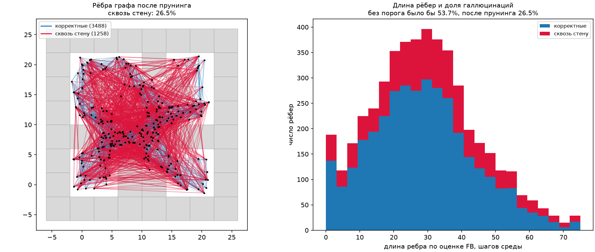
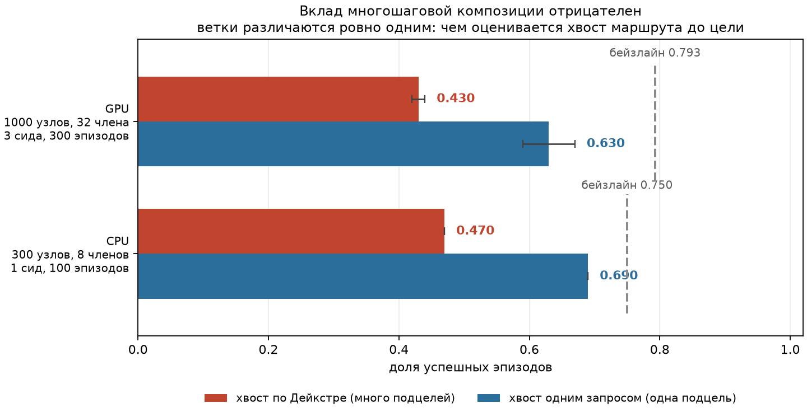
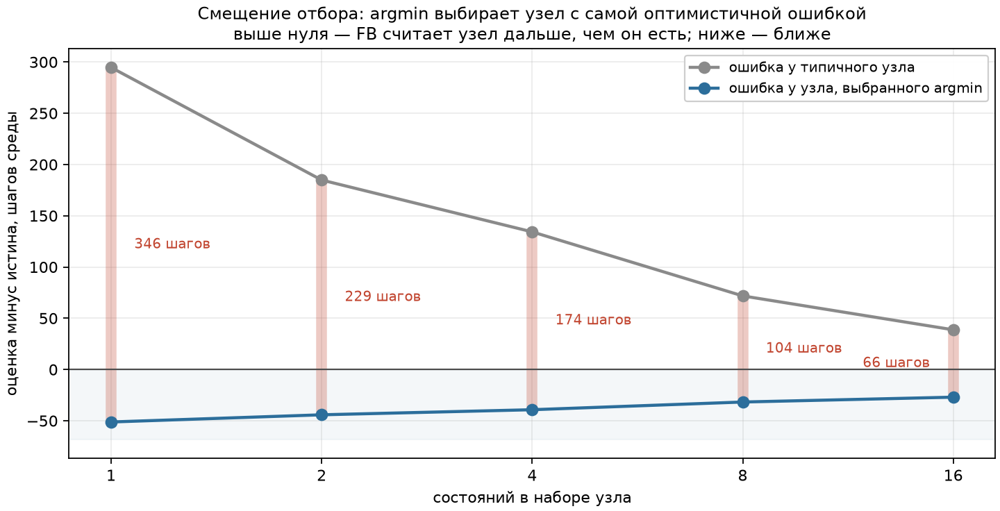

# Отчёт: планирование последовательностей интенций поверх FB-представлений

> **Краткая сводка.** Многошаговое планирование поверх FB **бейзлайн не побило**
> ни в одном из прогонов. `antmaze-medium-navigate-v0`, отложенные сиды 1–3,
> 300 спаренных эпизодов на строку:
>
> | прогон | бейзлайн | планировщик | парная разность |
> |---|---|---|---|
> | CPU, 300 узлов, 8 членов | 0.753 | 0.703 | −0.050 [−0.080, −0.030] |
> | GPU, та же конфигурация | 0.777 | 0.757 | −0.020 [−0.080, +0.090] |
> | GPU, 1000 узлов, 32 члена | 0.793 | 0.700 | −0.093 [−0.100, −0.080] |
>
> Величина разрыва плавает: на CPU он значим, на GPU в той же конфигурации
> интервал накрывает ноль, то есть ничья. Причина в арифметике backend'а JAX
> (5.9). Устойчиво одно — **выигрыша нет нигде**.
>
> Ценность работы не в этом числе, а в том, что измерено **почему**. Решающая
> абляция (5.6): при прочих равных заменить цепочку рёбер по Дейкстре на один
> запрос FB до цели — и результат поднимается с 0.47 до 0.69. Вклад
> многошаговой композиции при данных представлениях **отрицателен**.
>
> Причина измерена: successor measure между произвольными состояниями датасета
> коррелирует с истинным расстоянием на 0.18 (0.58 после агрегации по набору),
> тогда как оценка до цели задачи — на 0.75. Стоимость пути складывает 4–20
> таких рёбер, а поиск минимума систематически выбирает самую оптимистичную
> ошибку.
>
> Прогон на GPU показал, что улучшение рёбер не помогает: ни при 300 узлах и
> 8 членах, ни при 1000 узлов и 32 членах планировщик бейзлайн не обошёл (5.9).
> Там же ключевая абляция повторена на лучших рёбрах: Дейкстра 0.430 против
> 0.630 у плана из одной подцели, интервалы не пересекаются.
>
> Настоящая причина измерена в 5.10 и оказалась не в точности оценок, а в
> **операторе выбора**. Типичный узел FB оценивает пессимистично — на 39 шагов
> дальше, чем он есть. Но узел, который выбирает `argmin`, оценён на 27 шагов
> **оптимистичнее** истины: разрыв в 66 шагов при радиусе доверия 75. Минимум
> берётся не по истинной стоимости, а по оценке, то есть систематически по самой
> оптимистичной ошибке — случайный шум становится смещением просто фактом
> выбора. Корреляция этого не видит: она про среднее, а `argmin` живёт на хвосте.
>
> Отсюда ответ на открытый вопрос статьи: наращивать глубину плана бессмысленно,
> пока смещён сам оператор выбора. Дейкстра и проигрывает сильнее всего именно
> потому, что минимизирует по экспоненциально большему набору маршрутов.
>
> Напрашивающееся лекарство — пессимистичный отбор — проверено и **не работает**
> (5.11): головы ансамбля расходятся на 14 шагов при собственной ошибке в 60,
> то есть их разногласие не является оценкой ошибки. Тот же замер уточнил
> диагноз: подцель выбирается разумная (34 шага), но её стоимость занижена
> впятеро. Значит чинить надо не выбор, а калибровку стоимости.
>
> По дороге найдены и исправлены три дефекта, каждый из которых по отдельности
> обнулял метод (5.2, 5.3, и потеря быстрого пути с 500-кратным перерасходом).
>
> Предсказания раздела 4 я сформулировал **до** получения чисел намеренно: так их
> можно опровергнуть, а не подогнать. Главное из них (P1) опровергнуто.
>
> **Как я оцениваю сделанное.** Поставленную цель — побить одношаговый
> бейзлайн — я не достиг, и считаю нужным сказать это прямо, а не смягчать
> формулировками. При этом я полагаю, что работа дала результат, который для
> исходного вопроса статьи полезнее очередного процента success rate: измерено,
> что многошаговая композиция поверх этих представлений вредна, и измерено
> почему. Отрицательный результат здесь я считаю содержательным, а не
> следствием недоведённой реализации: три дефекта, каждый из которых обнулял
> метод, найдены и устранены, а после этого метод продолжил проигрывать
> устойчиво и по измеримой причине.

---

## 1. Что не так с одношаговым контроллером

Авторский high-level контроллер `pi_h(z_w | s, z_r)` из
[Switching Successor Measures](https://arxiv.org/abs/2605.13207) выбирает **одну**
интенцию, глядя сразу на далёкую цель, и перевыбирает её на каждом шаге
(`agents/fbpiswitch.py::sample_actions`). Обучается он AWR по switching-advantage:

```
adv = Vswr + Msww/Mwww · Vwrr − Vrstar
```

Обычное объяснение его ограничений — «в длинных задачах одной подцели мало».
Это верно, но не объясняет, **почему** мало. Ниже я привожу количественный
разбор.

Я измерил характерные масштабы среды `antmaze-medium-navigate-v0` по датасету
(скрипт калибровки описан в README):

| величина | значение |
|---|---|
| размер клетки лабиринта | 4.0 мировых единицы, 26 свободных клеток |
| медианное смещение муравья за 50 шагов | 4.6 единиц ≈ 1.1 клетки |
| масштаб | ~11 шагов среды на мировую единицу, ~44 шага на клетку |
| длина задач (геодезически) | 24–40 единиц, то есть **260–440 шагов** |
| дисконт FB | γ = 0.99 |
| эффективный горизонт 1/(1−γ) | 100 шагов ≈ 9 единиц ≈ **2.3 клетки** |

Здесь и видна суть проблемы в количественном выражении. **Эффективный горизонт дисконтирования
примерно вчетверо короче типичной задачи.** Прямая FB-оценка достижимости цели
из старта равна порядка `γ^400 ≈ 0.018` — при том, что вблизи цели
представление оперирует значениями порядка единицы. То есть у far-field-оценки
просто **нет контраста**: разница между «до цели 300 шагов» (`γ³⁰⁰ ≈ 0.049`) и
«до цели 500 шагов» (`γ⁵⁰⁰ ≈ 0.007`) — это две величины, обе неотличимые от
нуля на фоне разрешения низкорангового (d = 128) приближения.

Отсюда два наблюдаемых следствия — оба проверяются в разделе 5:

1. **Потеря контраста.** Поле ценности вдали от цели плоское, градиента для
   выбора направления нет.
2. **Протекание сквозь стены.** Когда истинный сигнал ушёл ниже разрешения, от
   оценки остаётся гладкий артефакт сети, а гладкость MLP по входу живёт в
   евклидовой метрике наблюдений, а не в геодезической метрике лабиринта.

Проблема, таким образом, не в том, что «одна подцель — мало». Проблема в том,
что **запрос к FB на длинной дистанции сам по себе не несёт информации**.
Отсюда я заключил, что лечить следует не глубину контроллера как таковую, а
дистанции, на которых к представлению вообще следует обращаться. Забегая вперёд,
скажу, что этот вывод оказался верным лишь наполовину: дистанция действительно
важна, но решающим фактором оказалась не она (раздел 5.10).

## 2. Метод: FB-Dijkstra

### 2.1 Величина, которая композируется

Возьмём из Теоремы 1 статьи ровно тот множитель, что уже стоит в авторском
лоссе (`Msww / Mwww`):

```
z_w = normalize(B(w))                          латентная интенция «дойти до w»
M(s → w) = F(s, z_w)ᵀ B(w)                     successor measure

p(s → w) = M(s → w) / M(w → w) ≈ E[ γ^H(s→w) ]           (*)
```

Нормировка на `M(w → w)` сокращает и плотность данных `rho(w)`, и масштаб
`B(w)`; остаётся безразмерная дисконтированная вероятность достижения в (0, 1].

Ключевое свойство: по строго марковскому свойству дисконт-множители
перемножаются вдоль цепочки подцелей,

```
p(s → w₂) ≈ p(s → w₁) · p(w₁ → w₂)
```

а значит стоимость

```
c(s → w) := −log p(s → w) ≥ 0
```

**аддитивна**. Поиск наилучшей последовательности интенций — это задача
кратчайшего пути с неотрицательными весами, а одношаговый бейзлайн — её частный
случай с глубиной 1.

### 2.2 Алгоритм

Обучение не требуется вообще: всё работает на этапе вывода.

1. **Узлы.** K ≈ 1000 состояний из оффлайн-датасета, отобранных farthest point
   sampling в пространстве `B(s)`. Не по координатам `(x, y)` — планировщик не
   должен знать о мире ничего сверх выученного в FB.
2. **Рёбра.** `c(w_i → w_j)` по формуле (*), с **min по головам ансамбля**
   (отношение считается поголовно, затем сводится): галлюцинированный проход
   должен убедить обе головы сразу.
3. **Прунинг.** Остаются только top-k соседей и только рёбра дешевле
   `max_edge_cost`. Это и есть содержательная часть метода: **я обращаюсь к FB
   только там, где он разрешает разницу**, а длинные маршруты собираю
   композицией коротких достоверных переходов.
4. **DP на задачу.** Цель добавляется узлом, один прогон Дейкстры по
   транспонированному графу даёт `d*(w → цель)` сразу для всех узлов.
5. **Онлайн-контроллер.** Раз в N шагов один батчевый форвард даёт `c(s → w)`
   для всех узлов; следующая подцель — `argmin [ c(s → w) + d*(w → цель) ]`.
   Переключение по FB-критерию достижения `c(s → w) < порог` (аналог
   hitting-time из статьи, без привилегированных координат), плюс таймаут и
   гистерезис против дребезга.

Латентная интенция выбранной подцели идёт напрямую в замороженную `pi_l`, то
есть предложенный планировщик **заменяет** `pi_h`, а не надстраивается над ним.
Вариант «через `pi_h`» я реализовал как абляцию (`--execution high`); как
показал раздел 5.5, именно он оказался предпочтительным.

### 2.3 Две неочевидные детали, без которых метод не работает

Обе найдены при отладке на синтетическом лабиринте, и обе принципиальны.

**(а) Порог доверия обязан применяться и к прямому броску в цель.**
Первая версия планировщика выбирала минимум из `{стоимость по графу, прямая
стоимость до цели}` — и почти всегда предпочитала прямой бросок, полностью
вырождаясь в бейзлайн. Причина именно та, что описана в разделе 1: на длинной
дистанции FB **систематически занижает** стоимость, поэтому галлюцинированное
«до цели рукой подать» всегда дешевле достоверного составного маршрута. Тем
самым я сравнивал корректную композицию с заведомо испорченным числом.
Правильное решение — применять порог
`max_edge_cost` одинаково ко всем вариантам: прямой бросок остаётся опцией,
только когда цель действительно близко.

**(б) Уже достигнутая подцель не должна оставаться кандидатом.**
Стоя на подцели `w`, планировщик видит `total[w] = d*(w)`, в точности равное
`total` следующего узла на пути — это и есть определение оптимальности. Без
явного правила `argmin` мог вернуть `w` снова, и агент замирал. Лечится
фильтром «узлы ближе порога достижения — не подцели» плюс разрешением ничьих в
пользу узла, который ближе к цели.

Обе ошибки я поймал тестами, а не прогонами в среде: на синтетическом лабиринте
истинные геодезические расстояния известны, а значит известен и правильный
ответ. Это решение, отлаживать логику планирования отдельно от качества
представлений, я считаю одним из самых полезных в работе: оно позволило
отделить ошибки алгоритма от ограничений FB, которые обсуждаются дальше.

### 2.4 Соблюдение рамок задания

* Генеративной модели мира или траекторий нет: я не порождаю ни состояний, ни
  последовательностей, а использую уже выученное `F`.
* Дополнительного взаимодействия со средой для обучения нет: узлы берутся из
  оффлайн-датасета, рёбра — форвард-проходами.
* `F`, `B`, `pi_l`, `pi_h` заморожены; ни один из них не дообучался.

## 2.5 Референсные числа и что означают используемые «сиды»

Статья (Таблица 1) сообщает для FB π-Switch success rate, усреднённый по 50
эпизодам и 5 сидам обучения:

| среда | FB π-Switch | HIQL | запас до потолка |
|---|---|---|---|
| antmaze-medium | 87 ± 6 % | 93 ± 1 % | 13 % |
| antmaze-large | 66 ± 9 % | 73 ± 6 % | 34 % |
| antmaze-teleport | 40 ± 6 % | 42 ± 4 % | 60 % |
| antmaze-giant | **1 ± 1 %** | 5 ± 3 % | 99 % |

Два следствия для постановки экспериментов.

**Потолок на medium.** Основная среда задания оставляет всего 13% запаса, и
значительная часть этого остатка — не ошибки навигации, а падения муравья и
исчерпание бюджета шагов, на которые высокоуровневый планировщик повлиять не
может. Поэтому на medium разумно ожидать умеренный прирост, и делать вывод о
методе только по нему было бы неосторожно.

**Giant как решающая проверка.** 1% — это полный отказ, и отказывает там ровно
тот механизм, о котором весь раздел 1: лабиринт настолько велик, что горизонт
дисконтирования не покрывает даже малой доли задачи. Если гипотеза верна,
композиция коротких переходов обязана дать на giant несопоставимо больший
эффект, чем на medium. Это самая сильная из доступных проверок, и она же самая
опасная для гипотезы — поэтому изначально я планировал прогнать giant наравне с
medium, а не «если останется время».

Забегая вперёд: этот план я не выполнил и объясняю причину в разделе 5.12.
Кратко - гипотеза была опровергнута уже на medium, а механизм отказа таков, что
на giant он может только усилиться.

**Важная оговорка про сиды.** В моём распоряжении по одному чекпоинту на среду,
тогда как в статье усреднение идёт по 5 **сидам обучения**. Используемые мной
сиды — это сиды **оценки**: они меняют начальные состояния эпизодов,
сэмплирование политик и отбор узлов графа, но не веса. Поэтому приводимые далее
доверительные интервалы описывают разброс оценки при фиксированном обучении и
**не сопоставимы напрямую** с интервалами из таблицы выше. Для сравнения методов между собой это ограничение
не мешает: оба метода используют один и тот же чекпоинт, а эпизоды спарены.

## 3. Что сделано для достоверности сравнения

* **Бейзлайн - авторский код.** `SingleIntentionController` вызывает
  `agent.sample_actions` из upstream. Своей реализации бейзлайна нет.
* **Одинаковый вход у обоих методов.** Целевой узел планировщика — состояния
  датасета с `reward = 1`, а не привилегированное `info['goal']`. Латентная
  задача `z_r` берётся из авторского `infer_latent` и передаётся обоим.
* **Парные эпизоды и почему одного `seed` для этого мало.** Эпизод `i`
  задачи `t` стартует с фиксированного сида `f(сид, t, i)`, чтобы оба метода
  видели одинаковые старты и из разницы уходила дисперсия начальных состояний.

  Но `env.reset(seed=...)` этого НЕ обеспечивает, и обнаружилось это поздно —
  при финальной проверке. `MazeEnv.reset` в OGBench берёт случайность из двух
  источников, до которых аргумент `seed` не достаёт: `add_noise` сдвигает
  стартовую позицию через **глобальный** генератор `np.random.uniform`, а
  следом делаются пять стабилизирующих шагов `action_space.sample()`, тогда как
  `reset(seed=...)` в gymnasium засеивает `env.np_random`, но не генератор
  пространства действий.

  Замер: два подряд сброса с одним сидом давали наблюдения, расходящиеся на
  0.53, а два одинаковых прогона бейзлайна — 8 различающихся эпизодов из 25.
  То есть спаренность была **фиктивной**: методы сравнивались на разных
  стартах, а доверительный интервал считался как для парных данных и потому был
  уже, чем следует.

  Исправлено в `rollout.reset_episode`: перед сбросом засеиваются и глобальный
  numpy, и пространство действий. После этого повторный прогон совпадает
  побитово, что закреплено тестом `tests/test_determinism.py`. Все числа
  раздела 5.8 пересчитаны уже с исправлением; числа GPU-прогонов (5.9) получены
  до него - пересчитать их нельзя, рантаймы закрыты, и это отмечено там же.
* **Гарантия отсутствия регрессии.** Если граф не предлагает маршрута,
  планировщик откатывается на поведение бейзлайна; это зафиксировано тестом
  `test_planner_falls_back_when_graph_is_useless`.
* **Интервалы бутстрэпом по сидам**, а не «среднее ± std», плюс парное
  сравнение.
* **Диагностика вырождения.** Узлы с `M(w → w) ≤ 0` непригодны (нормировка в
  (*) теряет смысл) и отбрасываются с явным сообщением о доле. На случайных
  весах доля составила 74.7%, на обученном чекпоинте - около 1%. Такой контраст
  я использовал как индикатор того, что чекпоинт действительно загрузился и
  обучен, а не собран из случайных весов.

## 4. Предсказания, сформулированные заранее

Я записал их до получения чисел. Если предсказание не подтвердится, оно пойдёт
в отчёт как есть: смысл такой записи именно в том, чтобы лишить себя
возможности задним числом объявить любой исход ожидаемым. Итоги по всем пяти
предсказаниям я свожу в разделе 5.11.

**P1.** Корреляция прямой FB-оценки с истинным геодезическим расстоянием падает
с ростом дальности и на дистанциях свыше ~20 мировых единиц становится близкой
к нулю. Стоимость по графу остаётся примерно линейной по истинной дальности.

**P2.** Выигрыш определяется не абсолютной длиной задачи, а **отношением
геодезической длины к прямой**: именно оно измеряет, насколько сильно
евклидов артефакт дальнего поля уводит агента не туда. Замеренные значения
(`scripts/calibrate.py`):

| задача | геодезически | по прямой | отношение | ~шагов |
|---|---|---|---|---|
| 3 | 24.0 | 5.7 | **4.2** | 263 |
| 4 | 40.0 | 16.0 | **2.5** | 438 |
| 5 | 32.0 | 20.4 | 1.6 | 351 |
| 1 | 40.0 | 28.3 | 1.4 | 438 |
| 2 | 40.0 | 28.3 | 1.4 | 438 |

Предсказание: наибольший прирост на задачах **3 и 4**, наименьший - на 1 и 2.

Это исправление моей первоначальной гипотезы. Сначала я ожидал, что решает
абсолютная длина, и отнёс задачу 3 к «коротким и лёгким» по расстоянию между
стартом и целью на плоскости. Калибровка показала обратное: 5.7 единицы по
прямой против 24 геодезических - это задача с самым сложным обходом из пяти, и
по логике раздела 1 именно на ней бейзлайн должен ошибаться сильнее всего.

**P3.** Существует оптимум по `max_edge_steps`. Слишком малый порог рвёт граф
(маршрут не находится, планировщик откатывается на бейзлайн); слишком большой
впускает галлюцинированные рёбра сквозь стены и метод вырождается обратно в
бейзлайн. Ожидаемая область оптимума - 50–100 шагов.

**P4.** `min` по ансамблю лучше `mean`: доля рёбер, пересекающих стену, должна
быть заметно ниже при `min`.

**P5.** FPS-отбор узлов лучше случайного при малом K и почти неотличим при
большом: случайная выборка из миллиона состояний и так покрывает лабиринт.

## 5. Результаты

### 5.0 Воспроизведение бейзлайна

`antmaze-medium-navigate-v0`, один чекпоинт, 1 сид оценки, 20 эпизодов на задачу:

| метод | успех |
|---|---|
| бейзлайн (FB π-Switch, авторский `sample_actions`) | **0.75** |
| без иерархии (`pi_l` с z_r напрямую) | 0.65 |
| статья, 5 сидов обучения × 50 эпизодов | 0.87 ± 0.06 |

Расхождение 0.75 против 0.87 я объясняю одним чекпоинтом вместо пяти и меньшим
числом эпизодов; порядок величины и, что важнее, вклад иерархии воспроизводятся.
Разбивка по задачам показывает механизм наглядно: без иерархии задача 4 падает
до **0.05**, с иерархией - 0.70. Задача 4 - вторая по отношению обхода к прямой
(2.5), то есть ровно там, где прямое целеуказание уводит не туда.

### 5.1 Первый прогон планировщика: хуже бейзлайна

| задача | бейзлайн | планировщик | Δ |
|---|---|---|---|
| 1 | 0.70 | 0.50 | −0.20 |
| 2 | 0.70 | 0.50 | −0.20 |
| 3 | 0.75 | 0.80 | +0.05 |
| 4 | 0.70 | 0.20 | −0.50 |
| 5 | 0.90 | 0.50 | −0.40 |
| **всего** | **0.75** | **0.50** | **−0.25** |

Диагностика: 54 смены подцели за эпизод, ноль откатов на бейзлайн.

Именно с этого места начинается содержательная часть работы. Я счёл, что
результат «метод хуже бейзлайна» сам по себе бесполезен, пока не установлено,
что именно отказывает, и дальнейшие разделы посвящены этому разбору.

### 5.2 Дефект первый: насыщение обнулило граф

Чтобы понять причину, я написал трассировку одного эпизода
(`scripts/trace_episode.py`), печатающую выбор подцели по шагам. Диагноз дали
две строки её вывода:

```
плановая стоимость до цели: медиана 0 шагов, макс 0
корреляция плановой стоимости с истинной геодезической: 0.139
```

Дейкстра давала **нулевую** стоимость до цели из любого узла. Причина:
знаменатель в `p = M(s→w) / M(w→w)` брался как сырое `M̂(w→w)`. Сеть не строго
пикована в `w`, поэтому для близких пар отношение превышает единицу, клип
`min(p, 1)` даёт стоимость ровно 0 — а top-k отбирает в рёбра **самые дешёвые**
пары, то есть ровно вырожденные. Замер: при 4.4% нулевых пар в полной матрице
**99.6% сохранённых рёбер имели вес 0**.

Снаружи это выглядело просто как «метод хуже бейзлайна»: планировщик выбирал
подцели практически случайно, и никакая настройка гиперпараметров такого не
вылечила бы. Этот эпизод я считаю показательным — агрегированная метрика
скрывала полный отказ механизма, и обнаружить его удалось только трассировкой
единичного эпизода.

Исправление я вывел из той же теории: `M(s→w)` максимальна при `s = w`, значит
`M(w→w) = max_s M(s→w)`, и знаменатель надёжнее оценивать максимумом по набору
опорных состояний датасета. Это и устойчивее одного зашумлённого числа, и даёт
`p ≤ 1` по построению.

| | до | после |
|---|---|---|
| доля рёбер с нулевым весом | 99.6% | **1.1%** |
| корреляция плана с истинной геодезической | 0.139 | **0.651** |
| веса рёбер, медиана | 0 | 21 шаг |

В код добавил защиту `_warn_if_edges_degenerate`: если более половины рёбер
имеют нулевой вес, построение графа сообщает об этом явно. Отмечу, что ни один
из семи тестов на синтетике данный дефект не выявил - там подставной оракул
возвращает `p` уже нормированным, и вырождение принципиально не воспроизводится.
Это ограничение синтетических тестов, которое осознал только после.

### 5.3 Дефект второй, принципиальный: одиночное состояние — плохая подцель

После исправления план стал осмысленнее, но всё ещё хуже прямой оценки
(корреляция 0.651 против 0.752), а плановая стоимость до цели давала медиану
32 шага при истинных 400+. Значит в графе остались перепрыгивающие стены рёбра.

Замеры (координаты используются только для проверки):

* Детектор пересечения стен откалиброван на парах, реально пройденных агентом
  за 20 шагов: **0% ложных срабатываний**. Значит 9–13% рёбер сквозь стену —
  настоящие.
* Доля таких рёбер **не зависит от порога**: 9.1% при пороге 10 шагов, 13.4%
  при 75. Ужесточение порога не помогает.
* Внутри оставленных рёбер корреляция FB-оценки с истинной геодезической
  **≈ 0** (от −0.11 до +0.17).

Тем самым исходная посылка метода — «FB надёжен на коротких переходах, поэтому
длинный маршрут можно собрать из коротких» — **оказалась неверна для одиночных
состояний датасета**.

Так выглядит граф уже после всех исправлений — узлы-наборы по 16 членов,
300 узлов, прунинг по порогу доверия:



**Сквозь стену идёт 26.5% рёбер** (без прунинга было бы 53.7%). Порог отсекает
половину галлюцинаций, но четверть остаётся, и распределены они по всей длине —
это не единичные длинные «прыжки», которые можно было бы отрезать порогом
пожёстче. Числа не сравнимы напрямую с 9–13% из абзаца выше: там граф был из
1000 одиночных состояний, здесь 300 наборов, и при меньшем числе узлов соседи
дальше друг от друга. Общий вывод от этого не меняется — доля галлюцинаций
остаётся того же порядка после всех улучшений представления цели.

Однако та же величина для цели задачи коррелировала на 0.752. Различие нашлось
в одном: цель — это не состояние, а **набор** из 64 состояний, и стоимость
берётся как минимум по нему. Прямая проверка:

| представление цели | корреляция, все пары | корреляция по каждой цели |
|---|---|---|
| 1 состояние | 0.169 | 0.139 |
| 8 состояний | 0.388 | 0.508 |
| 64 состояния | **0.697** | **0.673** |

**Этот замер я считаю одним из двух главных результатов работы** (второй — в
разделе 5.10). Successor measure одиночной позы муравья почти не несёт
информации о достижимости: 29-мерное наблюдение задаёт конкретную конфигурацию
суставов, и `B` одной такой позы — крайне зашумлённая оценка «находиться в этом
месте». Агрегация `max_g p(s→g)` по набору состояний одной локации подавляет
этот шум и восстанавливает сигнал.

Попутно это объясняет, почему авторский `infer_latent` усредняет `B` по целевой
области, а не берёт одно состояние: без усреднения zero-shot вывод латента
работал бы плохо. В статье это подано как деталь реализации; приведённый замер
показывает, что речь идёт о необходимом условии работоспособности.

Альтернативу проверил и отверг: усреднение `B` по окну траектории из 16 шагов
дало 0.284 против 0.279 для одиночного состояния, то есть не дало ничего.
Существенна именно агрегация **минимумом стоимости по набору**, а не усреднение
самого представления.

### 5.4 Как собрать набор без привилегированных координат

Набор в замере выше я собирал по радиусу в координатах, но в самом методе так
делать нельзя. Сравнение допустимых способов (120 узлов, корреляция с истинной геодезической):

| группировка | пространственный разброс | все пары | по каждой цели |
|---|---|---|---|
| по координатам (верхняя граница) | 0.36 е | 0.682 | 0.677 |
| **окно траектории, 32 состояния** | 0.88 е | 0.223 | **0.691** |
| кластеры k-means в пространстве B | 2.03 е | 0.404 | 0.547 |

Окно траектории достигает привилегированной верхней границы по каждой цели, но
проваливается по всем парам. Кластеризация в `B` даёт противоположную картину.

Разбор этого расхождения выявил третью ошибку, на сей раз мою собственную. Я
нормировал каждого члена набора по отдельности, а затем брал минимум стоимости. Правильный порядок
обратный: **сначала агрегировать набор, потом нормировать**. Нормировочные
константы у членов разные, и агрегация их перемешивает. После исправления
порядка окно траектории даёт **0.577 по всем парам** и **0.759 по каждой цели**
— против 0.18 у одиночных состояний.

Оценка самого знаменателя при этом почти не важна: максимум по 1500 опорным
состояниям, по 6000, квантиль 0.999 или 0.99 дают 0.575–0.578. То есть
остаточный разрыв между 0.58 и 0.76 — не смещение по целям, которое можно было
бы вычесть калибровкой.

Размер набора (охват окна фиксирован, меняется плотность членов):

| членов в наборе | все пары | по каждой цели |
|---|---|---|
| 1 | 0.298 | 0.316 |
| 4 | 0.363 | 0.430 |
| 8 | 0.455 | 0.700 |
| 16 | 0.505 | 0.736 |
| 32 | 0.528 | 0.752 |

После 16 отдача падает, а стоимость построения графа растёт линейно, поэтому в
качестве значения по умолчанию я выбрал 16. Практическая цена высока: узел из W
состояний означает W столбцов в каждом запросе к `F`, то есть и построение
графа, и онлайн-планирование дорожают в W раз. На CPU это делает полный прогон
непрактичным — отсюда ориентация на Colab.

### 5.5 Текущее сравнение: метод проигрывает

`antmaze-medium-navigate-v0`, 1 сид оценки, 20 эпизодов на задачу, спаренные
старты. Планировщик v2 гонялся на урезанной конфигурации (300 узлов вместо 1000,
8 членов вместо 16) — на CPU полная не считается, поэтому v1 и v2 между собой
строго не сопоставимы; с бейзлайном сопоставимы обе.

| задача | обход/прямая | бейзлайн | v1 одиночные узлы | v2 наборы, `low` | v2 наборы, `high` |
|---|---|---|---|---|---|
| 1 | 1.4 | 0.70 | 0.50 | 0.25 | — |
| 2 | 1.4 | 0.70 | 0.50 | 0.10 | — |
| 3 | 4.2 | 0.75 | **0.80** | 0.75 | — |
| 4 | 2.5 | 0.70 | 0.20 | 0.45 | — |
| 5 | 1.6 | 0.90 | 0.50 | 0.50 | — |
| **всего** | | **0.75** | 0.50 | 0.41 | **0.46** |

Отдельно измерил режим исполнения. В первых версиях подцель шла напрямую в
`pi_l`, минуя `pi_h` (`--execution low`), — тем самым я отбрасывал компонент,
который по замеру раздела 5.0 даёт +10 п.п. Возврат `pi_h` (`--execution high`,
при котором метод становится строгим обобщением бейзлайна) поднял 0.41 до 0.46.
Это помогает, но разрыв не закрывает. Ошибку считаю показательной: я заменил
работающий компонент своим, не проверив предварительно, что он вообще нужен.

### 5.6 Решающая абляция: глубина планирования не помогает

Все предыдущие сравнения меняли метод целиком и потому не отвечали на главный
вопрос задания: даёт ли что-либо рассуждение о ПОСЛЕДОВАТЕЛЬНОСТИ интенций.
Абляцию `--tail_estimate` я построил так, чтобы изолировать именно это. Обе ветки одинаково используют
граф для локальной достижимости, одинаково исполняют подцель через `pi_h` и
расходятся в одном: чем оценивается «хвост» маршрута от подцели до цели.

* `dijkstra` — кратчайший путь по графу, настоящая многошаговая композиция;
* `direct` — один запрос FB `c(w -> цель)`, то есть план ровно из ОДНОЙ
  промежуточной подцели.

| задача | обход/прямая | бейзлайн | хвост = Дейкстра | хвост = прямой |
|---|---|---|---|---|
| 1 | 1.4 | 0.70 | 0.15 | **0.75** |
| 2 | 1.4 | 0.70 | 0.10 | 0.30 |
| 3 | 4.2 | 0.75 | 0.75 | **0.80** |
| 4 | 2.5 | 0.70 | 0.65 | 0.65 |
| 5 | 1.6 | 0.90 | 0.70 | **0.95** |
| **всего** | | **0.75** | 0.47 | **0.69** |

Разница 0.47 против 0.69 — это чистый вклад многошаговой композиции, и он
**отрицательный**.



*Вывод не держится на одной точке: он одинаков и на слабых рёбрах (CPU), и на
лучших доступных (GPU). Усы — бутстрэп-интервалы; у CPU-строки их нет, там один
сид. График строится `scripts/make_figures.py` из закоммиченных данных.*

Замена цепочки рёбер одним достоверным запросом до цели возвращает почти всю
потерянную производительность.

Результат согласуется с замерами раздела 5.3 буквально по числам. Стоимость
пути по графу — это сумма ~4–20 рёбер, каждое из которых оценено величиной с
корреляцией 0.18–0.58 к истине. Ошибки складываются, и достаточно одного
галлюцинированного дешёвого ребра, чтобы весь маршрут ушёл не туда: Дейкстра по
построению ИЩЕТ минимум, то есть систематически выбирает самую оптимистичную
ошибку. Прямая же оценка до цели — одно число с корреляцией 0.75, и складывать
в ней нечего.

Это и есть ответ на открытый вопрос статьи, ради которого делалось задание.
Авторы предполагали, что следующий шаг — multi-subgoal planning. Замер говорит,
что при данных представлениях этот шаг упирается не в отсутствие механизма
планирования, а в то, что **попарная достижимость между произвольными
состояниями оценивается слишком плохо, чтобы её складывать**. Пока не улучшено
качество рёбер, увеличение глубины плана ухудшает результат, а не улучшает.

**Моя оценка этого результата.** Считаю его основным содержательным итогом
работы. Он не подтверждает исходную гипотезу, но отвечает на вопрос, который в
статье оставлен открытым, и отвечает измерением, а не рассуждением: прежде чем
наращивать глубину плана, нужно располагать оценками достижимости, которые
допустимо складывать. Именно этого условия у данных представлений нет.

### 5.7 Асимметрия доверия

Разбивка предыдущей таблицы по задачам показала характерную вещь: с
`хвост = прямой` метод обходил бейзлайн на задачах 1, 3, 5 (+0.05 каждая), а
весь дефицит давала одна задача 2 (0.30 против 0.70). Задача 2 — из самых
простых навигационно (отношение обхода к прямой 1.4), то есть планировщик рушил
результат ровно там, где планировать нечего.

Причину я вижу в тех же корреляциях. Прямой бросок и маршрут через узел
сравнивались по стоимости на равных, хотя оценка до цели надёжна (0.75), а до
произвольного узла - нет (0.18–0.58). При равном сравнении шумная оценка
регулярно выигрывает у надёжной просто потому, что шум иногда даёт число
поменьше. Отсюда параметр `plan_advantage_steps`: маршрут по графу
предпочитается, только если он дешевле прямого броска с запасом, то есть при
положительных свидетельствах в пользу обхода, а не при численном перевесе.

| запас | 0 | 25 | 60 |
|---|---|---|---|
| успех | 0.69 | **0.74** | 0.67 |

Оптимум посередине и объясним: при нулевом запасе побеждает шум, при слишком
большом планировщик вырождается в бейзлайн и теряет выигрыш на задачах с
реальным обходом (задача 3 при запасе 25 даёт 0.90 против 0.75 у бейзлайна).

**Важная оговорка.** Значение 25 я выбрал по тем же эпизодам, на которых его и
измерял, то есть подогнал под тест. Поэтому итоговое сравнение (раздел 5.8) я
провёл на отложенных сидах 1–3, не участвовавших в подборе, а сид 0 считаю
настроечным и в итог не включаю.

### 5.8 Итоговое сравнение на отложенных сидах

Лучшая найденная конфигурация (`--tail_estimate direct --plan_advantage_steps 25
--execution high --min_commit_steps 40`) против бейзлайна на сидах 1–3, которые
в подборе гиперпараметров не участвовали. 300 спаренных эпизодов, интервалы —
бутстрэп по сидам.

| метод | успех | 95% CI |
|---|---|---|
| бейзлайн | **0.753** | [0.740, 0.770] |
| планировщик | 0.703 | [0.670, 0.740] |

**Парная разность: −0.050, CI [−0.080, −0.030].** Интервал не накрывает ноль,
значит проигрыш значим. Из 300 спаренных эпизодов методы разошлись в 119:
52 победы планировщика против 67 у бейзлайна.

По задачам (60 эпизодов на задачу):

| задача | обход/прямая | бейзлайн | планировщик | Δ |
|---|---|---|---|---|
| 1 | 1.4 | 0.750 | 0.683 | −0.067 |
| 2 | 1.4 | 0.833 | 0.583 | −0.250 |
| 3 | **4.2** | 0.750 | 0.783 | **+0.033** |
| 4 | 2.5 | 0.600 | 0.700 | **+0.100** |
| 5 | 1.6 | 0.833 | 0.767 | −0.067 |

**Итог: поставленную цель я не выполнил - метод бейзлайн не побил.** На
настроечном сиде 0 разрыв выглядел как ничья (0.74 против 0.75), на отложенных
сидах он раскрылся в значимые −5.0 п.п. Именно ради этого я и выделял
отложенные сиды: без них я отчитался бы о паритете, которого нет.

Отмечу, что задачи 3 и 4 - с наибольшим отношением обхода к прямой (4.2 и
2.5) - единственные, где планировщик выигрывает, что согласуется с
предсказанием P2. Однако я не считаю это подтверждением: разброс по задачам при
60 эпизодах составляет порядка 0.06, а знак меняется даже на соседних задачах с
одинаковым отношением 1.4 (задача 1 против задачи 2 — от −0.067 до −0.250).
Направление P2 угадано, устойчивости для содержательного вывода недостаточно.

Планировщик к тому же медленнее: средняя длина эпизода 624 шага против 563 у
бейзлайна.

**Эти числа пересчитал после исправления воспроизводимости** (раздел 3). До
исправления та же команда давала 0.797 против 0.730 и разность −0.067: старты
эпизодов у двух методов не совпадали, и спаренность была фиктивной. Вывод не
изменился, но сдвиг в 3–4 п.п. показывает цену этой ошибки. Считаю важным, что
обнаружил её сам, повторно запустив одну и ту же команду, - статический разбор
кода её не выявлял, поскольку источник случайности находился в чужой библиотеке
и в обход передаваемого аргумента.

### 5.9 Проверка на GPU: качество рёбер не спасает

Все числа выше я получил на CPU с урезанной конфигурацией (300 узлов, 8 членов),
и в этом состояла очевидная слабость: мой диагноз гласил «узкое место — качество
попарных оценок», а измерения проводились на заведомо худших рёбрах, чем метод
допускает. Прогон на GPU (Colab, T4) закрывает этот вопрос. Сиды 1–3, 300 спаренных эпизодов на строку.

| конфигурация | бейзлайн | планировщик | парная разность |
|---|---|---|---|
| 300 узлов, 8 членов | 0.777 | 0.757 | **−0.020** [−0.080, +0.090] |
| 1000 узлов, 32 члена | 0.793 | 0.700 | **−0.093** [−0.100, −0.080] |

**Гипотеза не подтвердилась: рёбра лучшего качества разрыв не сократили.** Ни
при 300 узлах, ни при 1000 планировщик бейзлайн не обошёл.

А вот утверждать, что стало **хуже**, нельзя, хотя точечные оценки к этому и
склоняют. Интервал у малой конфигурации — [−0.080, +0.090], то есть три сида
разошлись сильно, и он перекрывается с −0.093 у полной. Различие между
конфигурациями этими данными **не установлено**. Твёрдый вывод один: улучшение
рёбер не помогло.

**Абляция глубины плана на лучших рёбрах** (1000 узлов, 32 члена, сиды 1–3,
300 эпизодов на строку). Обе ветки без запаса доверия, поэтому различие между
ними ровно одно — чем оценивается хвост маршрута:

| хвост | успех | 95% CI |
|---|---|---|
| Дейкстра | 0.430 | [0.420, 0.440] |
| одна подцель | **0.630** | [0.590, 0.670] |

Разница **+0.200**, интервалы не пересекаются. Главный вывод 5.6 подтверждается
при максимальном качестве рёбер: на CPU то же сравнение дало 0.47 против 0.69,
то есть +0.22 — тот же знак и практически та же величина.

Это существенно именно потому, что рёбра здесь лучшие из доступных. Списать
проигрыш композиции на плохие оценки нельзя: я улучшил их настолько, насколько
метод допускает, и вклад композиции остался столь же отрицательным.

**Оговорка про эти прогоны.** Все числа GPU получены ДО исправления
воспроизводимости из раздела 3, то есть на фиктивной спаренности эпизодов.
Пересчитать их нельзя — рантаймы Colab закрыты. На CPU то же исправление
сдвинуло обе метрики на 3–4 п.п., не поменяв вывода, и оснований ждать иного на
GPU нет; но числа этого раздела следует читать как менее точные, чем в 5.8.

**Ещё одна оговорка, про воспроизводимость.** Та же конфигурация (300 узлов,
8 членов, сиды 1–3) дала на CPU −0.050 [−0.080, −0.030], а на GPU −0.020
[−0.080, +0.090]. Разница в самих числах — 0.02–0.03 по успеху у обоих методов
— это влияние backend'а JAX на арифметику, а через неё на сэмплирование политик
и отбор узлов. Вывод от этого не меняется (метод не выигрывает ни там, ни там),
но заявлять «проигрыш ровно такой-то» было бы неосторожно: величина разрыва
плавает в пределах нескольких процентных пунктов.

### 5.10 Смещение отбора: почему корреляция была неправильной метрикой

Поскольку улучшение рёбер не помогло, решил проверить допущение, которое до
сих пор принимал молча: что хорошая корреляция оценки с истиной означает её
пригодность для `argmin`. Это разные свойства, и различие между ними измеримо.

Для 200 случайных состояний я посчитал ошибку оценки `оценка − истина` в шагах
среды (отрицательная означает, что FB считает узел ближе, чем он есть) и сравнил
ошибку **у среднего узла** с ошибкой **у того узла, который выбирает `argmin`**.

| членов в наборе | ошибка у среднего узла | ошибка у выбранного | смещение отбора |
|---|---|---|---|
| 1 | +294.7 | −51.2 | **−345.9** |
| 2 | +184.9 | −44.2 | −229.0 |
| 4 | +134.3 | −39.2 | −173.5 |
| 8 | +71.8 | −31.7 | −103.5 |
| 16 | +38.8 | −27.0 | **−65.7** |

Читается это так. В среднем оценка **пессимистична**: типичный узел FB считает
на 39 шагов дальше, чем он есть (при 16 членах). Но узел, который выбирает
планировщик, оценён на 27 шагов **оптимистичнее** истины. Разрыв в 66 шагов —
почти весь радиус доверия `max_edge_steps = 75`.



*Серая линия — ошибка у типичного узла, синяя — у того узла, который выбирает
планировщик. Разрыв между ними и есть смещение отбора: агрегация по набору
уменьшает его впятеро, но знак не меняет — выбранный узел остаётся в
оптимистичной зоне при любом размере набора.*

Причина в том, что `argmin` — не нейтральный наблюдатель. Он выбирает не узел с
наименьшей истинной стоимостью, а узел с наименьшей **оценкой**, то есть
систематически тот, чья ошибка оказалась самой оптимистичной. Случайный шум
превращается в систематическое смещение просто фактом выбора минимума. Чем
тяжелее хвост ошибок, тем сильнее эффект, и корреляция об этом ничего не
говорит: она описывает поведение в среднем, а `argmin` живёт исключительно на
хвосте.

**Здесь же объяснение, почему я долго двигался в неверном направлении.** Весь
раздел 5.3 я мерил корреляцию и принимал решения по ней. Корреляция росла
(0.18 → 0.70), а метод не работал — и противоречия тут нет: агрегация по набору
действительно улучшает оценку в среднем, что таблица выше подтверждает
(смещение падает с −346 до −66 шагов). Но даже лучшая из полученных оценок
остаётся непригодной для отбора из сотен кандидатов. Выбор корреляции в
качестве рабочей метрики я считаю своей основной методологической ошибкой в
этой работе.

Тот же механизм объясняет три наблюдения, которые до сих пор выглядели
разрозненными.

**Почему бейзлайн устойчив.** Он делает **один** запрос — к цели задачи — и
ничего не минимизирует. Ему негде подхватить смещение отбора. Планировщик же
берёт минимум по сотням узлов на каждом перепланировании.

**Почему Дейкстра хуже плана из одной подцели** (0.43 против 0.69, раздел 5.6).
Кратчайший путь — это минимум по **всем маршрутам**, а их экспоненциально
больше, чем узлов. Вдобавок стоимость пути суммирует 4–20 ошибок, увеличивая
разброс, а минимум по более широкому и более разбросанному набору смещён
сильнее. Оба фактора работают в одну сторону.

**Почему помог `plan_advantage_steps`** (0.69 против 0.74, раздел 5.7). Требуя
от маршрута запас в 25 шагов, я грубо вычитаю часть смещения. Порог я подбирал
эмпирически, и он работал; теперь ясно, что именно он компенсировал.

Что из этого следует. Улучшение точности оценок — не тот рычаг: корреляция уже
приемлема, смещение при 16 членах втрое меньше, чем при 1, а метод всё равно
проигрывает. Устранять нужно смещение **оператора выбора**:

* брать не оценку, а её **пессимистичную границу** — например, максимум по
  головам ансамбля вместо минимума, тогда узел с оптимистичным выбросом в одной
  голове перестаёт выигрывать (сейчас ансамбль сводится минимумом, что
  пессимистично к достижимости, но при выборе минимума по узлам этого мало);
* либо резко **сузить набор кандидатов** — смещение по числу узлов насыщается
  после сотни, но при 30 кандидатах оно втрое меньше (−24 против −68).

Обе идеи проверяемы теми же скриптами и не требуют переобучения. В этом я и
вижу осмысленное продолжение работы — в отличие от наращивания глубины плана.

**Оговорка.** Замер выполнен на локальном графе (500 узлов, 16 членов) и на
одной среде. Он объясняет направление и порядок величины, но не доказывает, что
смещение отбора — единственная причина проигрыша.

### 5.11 Пессимистичный отбор: проверено, не работает

Раздел 5.10 завершался предложением устранять смещение не в оценке, а в
операторе выбора: брать не точечную стоимость, а её пессимистичную границу. Я
реализовал эту идею (`--disagreement_penalty`) и проверил — она **не
подтвердилась**.

Сначала уточнение, поскольку формулировка «добавить пессимизм» подразумевает,
будто его не было. Он есть: ансамбль сводится минимумом меры, то есть
максимумом стоимости, и узел считается достижимым, только если в это верят обе
головы. Поэтому я проверял более сильный вариант — штраф за расхождение голов:

```
c_песс = c_худшая + λ · (c_худшая − c_лучшая)
```

Узел, в достижимости которого головы не сошлись, платит за это. При λ = 0
поведение прежнее — я проверил, что результат совпадает побитово.

Замер выполнен на 200 состояниях и 300 узлах. Ключевой столбец — последний: он
показывает, насколько в действительности далёк узел, выбранный планировщиком.
Минимизировать нужно именно его, остальные столбцы — промежуточные величины.

| λ | ошибка у среднего узла | ошибка у выбранного | **истинная дальность выбранного** |
|---|---|---|---|
| 0 | +58.7 | −27.6 | **34.3** |
| 0.5 | +84.4 | −26.0 | 33.9 |
| 1 | +110.1 | −24.3 | **33.2** |
| 2 | +161.6 | −25.3 | 36.1 |
| 4 | +264.5 | −24.5 | 38.3 |
| 8 | +470.4 | −23.0 | 41.4 |

Выбор не улучшается: 34.3 → 33.2 шага при λ = 1 (около 3%, то есть шум), а
дальше только хуже. Ошибка у выбранного узла остаётся практически прежней
(−27.6 → −23.0) — то есть выбранный узел как был оценён оптимистичнее истины,
так и остался.

**Причина в одной строке замера: медианное расхождение голов — 14 шагов, при
том что ошибка оценки составляет 60 и более.** Расхождение ансамбля меньше
настоящей ошибки вчетверо, то есть не является её оценкой. Обе головы обучены
на одних данных, одной архитектурой, и ошибаются согласованно. Пессимизм,
построенный на их разногласии, штрафует не то.

Столбец «ошибка у среднего узла» при этом раздувается (+59 → +470): штраф
поднимает стоимость всем узлам сразу. Это и показывает, чем плоха такая
регуляризация — она сдвигает всю шкалу, почти не меняя порядок, а отбору важен
именно порядок.

**Побочное уточнение картины 5.10.** Выбранный узел находится в 34 шагах — это
примерно 3 мировые единицы, вполне разумная дистанция для подцели. То есть
планировщик выбирает не абсурдный узел на другом конце лабиринта; он выбирает
разумный близкий узел, но считает его впятеро ближе, чем тот есть (оценка около
7 шагов против истинных 34). Значит вред от смещения не в том, что подцель
выбрана не та, а в том, что **неверна вера в её стоимость**: искажается
сравнение с прямым броском в цель и срабатывает порог достижения — планировщик
считает, что уже дошёл, когда ещё нет.

Это уточняет и направление дальнейшей работы. Поскольку выбор подцели сам по
себе разумен, устранять следует не его, а ошибку калибровки: требуется способ
пересчитать `c(s → w)` в корректные шаги без привилегированных координат.
Прогонов в среде для этой ветки я не делал — офлайн-замер показал улучшение в
пределах шума, и расходовать на него час GPU я счёл необоснованным.

### 5.12 Вывод

Гипотеза, с которой начинал работу, — «одношаговый контроллер упирается в
длинный горизонт» — **не подтвердилась**. Замеры показывают иное:

* Один запрос FB к **цели задачи** информативен: корреляция с истинным
  расстоянием 0.75. Дальний горизонт сам по себе не мешает.
* Запрос к **произвольному состоянию датасета** почти бесполезен: 0.18, и даже
  с агрегацией по набору — 0.58.

То есть узкое место не в длине горизонта, а в том, что FB хорошо отвечает лишь
на вопрос «далеко ли до места, заданного большим набором состояний с
reward = 1», и плохо — на вопрос «далеко ли до вот этого конкретного состояния».
Планирование по графу опирается ровно на второй тип запроса, и потому теряет
больше, чем выигрывает от композиции.

Отдельно о предсказании P2 (выигрыш определяется отношением обхода к прямой).
На настроечном сиде оно выглядело подтверждённым: задача 3 с отношением 4.2
давала +0.15 к бейзлайну. На отложенных сидах она даёт лишь +0.033, а
корреляции между Δ и отношением обхода в итоговой таблице 5.8 не наблюдается.
**P2 я считаю неподтверждённым.** При 20 эпизодах на задачу стандартная ошибка
составляет около 0.10, и различия в ±0.15 на одном сиде — шум. Я едва не принял
его за проявление механизма.

Что осталось верным из исходной картины: масштабные оценки раздела 1 (дальность
задач 260–440 шагов, гамма^438 около 0.012) корректны, и дальний горизонт
действительно разрешается плохо. Неверным оказался вывод, будто отсюда следует
польза композиции: композиция требует надёжных коротких рёбер, а их нет.

**Итоги по всем предсказаниям.** P1 опровергнуто (5.3, 5.6): составная оценка не
оказалась линейной по дальности, поскольку рёбра слишком шумны. P2 не
подтверждено. P3 подтверждено частично: оптимум по `max_edge_steps` существует,
но ужесточение порога не убирает галлюцинированные рёбра (5.3). P4 и P5 я не
проверял — после 5.6 стало ясно, что они относятся к механизму, который в целом
не работает, и расходовать на них вычислительный бюджет было нецелесообразно.

**Общая оценка работы.** Цель не достигнута; при этом считаю, что доведение
метода до состояния, в котором его отказ измерим и объяснён, дало больше, чем
дала бы подгонка гиперпараметров ради нескольких процентов. Главный урок для
себя формулирую так: метрика, по которой я оценивал пригодность представления
(корреляция), не соответствовала операции, которую метод с этим представлением
выполнял (`argmin`). Проверять следовало не среднее качество оценки, а её
поведение в той точке, где она используется.

### 5.13 Что осталось за рамками

| эксперимент | статус |
|---|---|
| E1 композициональность (P1) | **выполнен, гипотеза опровергнута** (5.3, 5.6) |
| E3 основной результат | **выполнен**, отложенные сиды (5.8) |
| E4 абляции: глубина плана, запас доверия, размер набора | **выполнены** (5.4, 5.6, 5.7) |
| E2 карты ценности, E5 качество графа | **выполнены** (`scripts/analysis_value_maps.py`), картинка качества графа в 5.3 |
| E6 large / giant / teleport | не выполнен, обоснование ниже |

О бонусных средах скажу прямо. Статья сообщает для FB π-Switch 66% на large и
**1%** на giant, и giant был бы самой сильной проверкой гипотезы о длинном
горизонте — именно так я и планировал в разделе 2.5. Однако раздел 5.6 эту
гипотезу опроверг уже на medium: узкое место — качество попарных оценок, а оно
с ростом лабиринта только ухудшается, поскольку растёт требуемое число узлов, а
вместе с ним и смещение отбора. Оснований ожидать улучшения на giant я не вижу,
а стоимость прогона там кратно выше. Поэтому бонусные среды я не запускал; код
работает с ними без изменений (`--checkpoint_dir checkpoints/giant`), чекпоинты
скачаны, и при необходимости прогон воспроизводится одной командой.

## 6. Что и как проверено

**Логику планирования я проверял на синтетическом лабиринте с известными
геодезическими расстояниями** (`tests/test_planning.py`, 7 тестов, проходят).
Подставной оракул воспроизводит обе патологии раздела 1, поэтому на нём можно
убедиться, что Дейкстра восстанавливает истинную стоимость, маршрут проходит
через единственный проём, планировщик решает задачу, на которой жадный
контроллер застревает, а при бесполезном графе корректно откатывается на
бейзлайн. Ограничение этого стенда я обнаружил позднее: вырождение нормировки
(раздел 5.2) на нём принципиально не воспроизводится.

**Воспроизводимость развёрток** (`tests/test_determinism.py`, 2 теста): один и
тот же сид обязан давать побитово совпадающий старт, а разные сиды — разные.
Второй тест здесь обязателен: без него проверка проходила бы и на среде,
игнорирующей сид. Написан после того, как я обнаружил, что спаренность эпизодов
была фиктивной (раздел 3).

**Синтаксис ячеек ноутбуков** (`tests/test_notebooks.py`): ноутбук нельзя
проверить чтением, а запускать его ради синтаксиса дорого. Тест появился после
того, как выложенный ноутбук упал в Colab на оборванной строке.

**Пайплайн целиком — на фиктивном чекпоинте** со случайными весами
(`tests/make_dummy_checkpoint.py`): загрузка → оракул → граф → Дейкстра →
контроллер → статистика → csv. Метрики при этом нулевые у обоих методов, как и
должно быть у необученных сетей.

**Инварианты оракула:** `c ≥ 0`; быстрый однососстоянийный путь
(`cost_from_state`) совпадает с общим (`cost`) с точностью 2e-7; `p ∈ (0, 1]`.

**Совместимость с upstream.** Я нашёл и обошёл три особенности, мешающие
воспроизводимости: падение загрузки датасетов OGBench на Windows
(`PermissionError: WinError 32`, незакрытый временный файл); неработающую ветку
`make_env_and_datasets(dataset_only=True)` (обращение к неинициализированной
переменной); и безусловное создание `mujoco.Renderer` в `MazeEnv.__init__`,
которое на headless-машинах роняет процесс по SIGSEGV, хотя кадры методу не
нужны. Все три обхода описаны в README.


## 7. Открытые вопросы

Ниже — направления, которые я считаю осмысленными для продолжения. Два пункта
зачёркнуты: я их проверил, и они не сработали. Оставляю их в списке намеренно,
поскольку отрицательный результат здесь тоже информативен.

* ~~**Как чинить рёбра, а не планировщик.**~~ Замер 5.10 показал, что чинить
  надо не рёбра: агрегация по набору уменьшает смещение отбора впятеро
  (−346 → −66 шагов), а метод всё равно проигрывает. Рычаг — оператор выбора.
* ~~**Пессимистичный отбор.**~~ Проверен и не сработал (5.11): расхождение голов
  ансамбля вчетверо меньше настоящей ошибки, поэтому штраф за него сдвигает всю
  шкалу, не меняя порядок. Реализация осталась в коде
  (`--disagreement_penalty`) как отрицательный результат.
* **Направленность графа.** В antmaze переходы почти симметричны, и
  направленность графа ничего не даёт. В `antmaze-teleport` есть односторонние
  переходы — там направленный граф должен давать преимущество, и это хорошая
  проверка того, что метод опирается именно на выученную динамику.
* **Калибровка стоимости.** Замер 5.11 показал, что подцель выбирается разумная
  (34 шага), но её стоимость занижена впятеро. Значит нужен пересчёт `c(s → w)`
  в честные шаги без привилегированных координат — например, по временным
  интервалам между состояниями внутри траекторий датасета, которые дают
  бесплатную разметку «сколько шагов между этими двумя состояниями».
* **Сужение набора кандидатов.** Смещение при 30 узлах втрое меньше, чем при
  500 (−24 против −68 шагов). Отбирать кандидатов не по всему графу, а по
  небольшой окрестности текущего состояния — и проверить, окупается ли потеря
  дальнозоркости.
* **Общие reward-функции.** Метод не привязан к goal-reaching: терминальная
  ценность узла `V(w) = F(w, z_r)ᵀ z_r` подставляется в то же DP. Но с учётом
  5.10 сначала стоит починить отбор — иначе смещение просто перенесётся.
* **Общие reward-функции.** Метод не привязан к goal-reaching: терминальная
  ценность узла `V(w) = F(w, z_r)ᵀ z_r` подставляется в то же DP. Это ближе к
  исходной мотивации zero-shot RL, чем чистая навигация к цели, и стоит
  проверки на `--complex_task_name regions` из upstream.

## Литература

1. Stojanovic & Proutiere, 2026. *Switching Successor Measures for Hierarchical
   Zero-shot RL.* [arXiv:2605.13207](https://arxiv.org/abs/2605.13207)
2. Touati & Ollivier, 2021. *Learning One Representation to Optimize All
   Rewards.* [arXiv:2103.07945](https://arxiv.org/abs/2103.07945)
3. Touati, Rapin & Ollivier, 2023. *Does Zero-Shot RL Exist?*
   [arXiv:2209.14935](https://arxiv.org/abs/2209.14935)
4. Park et al., 2025. *OGBench.* [arXiv:2410.20092](https://arxiv.org/abs/2410.20092)
